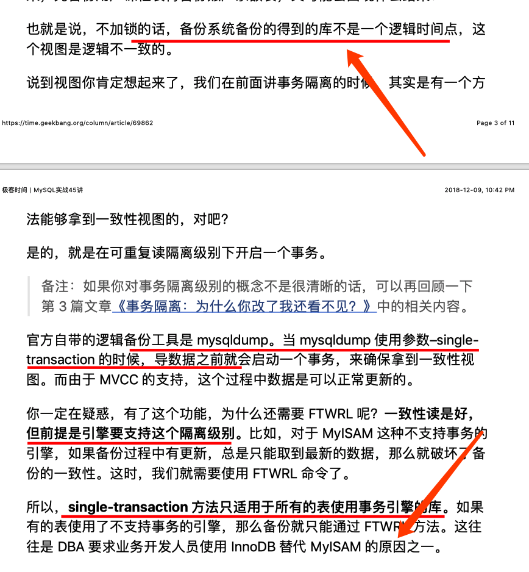

# Mysql
#Database #Mysql


### Table
- show create table table_name

### Version
- select version();

### Security
- set SQL_SAFE_UPDATES = 0;

### Status
- show status;
- show engine innodb status;
- show status like ‘table%’;  // table lock status
- show status like ‘Con%’   //totally connection
- show status like ‘Thread%’. // current connection
- show variables like ‘max_connections’; //max connection


```
show processlist;
explain ....
show index in tableName;
show status like '%lock%;
```

### Sql Clause 
- explain select * from table_name;
- show profiles; // query the sql execute time.
```
set profiling = 1 //session level
show profiles;
show profiles for query number;
```
- show processlist;

### dump
```
mysqldump --databases db1 db2 db3 -uroot -p > dump.sql
mysql -u <user> -p < dump.sql

```
### Log
- slow log
```

show variables like 'log%';
select sleep(6); //test if the slow query works.

in /etc/my.cnf configuration file.
slow_query_log =1
slow_query_log_file=/var/log/mysql_slow.log
long_query_time=5 //second

touch /var/log/mysql_slow.log

```

```
mysqldumpslow -h
-s sort, default sort by 'at', average time
-s c  sort by count
-t top
mysqldumpslow -s c -t 50 /var/log/mysql_slow.log
mysqldumpslow -t 10 /var/log/mysql_slow.log

```

### Engine
- alter table table_name engine = ‘innodb’;


### Index
- show index from table_name;
- create index index_name on table_name(field_name);
- drop  index index_name on table_name;

### Character
- show variables like ‘character_set_%’;
```
character_set_client    utf8
character_set_connection    utf8
character_set_database    latin1
character_set_filesystem    binary
character_set_results    utf8
character_set_server    latin1
character_set_system    utf8
character_sets_dir    /usr/share/mysql/charsets/
 
```

- show full columns from table_name;
- alter database database_name CHARACTER_SET = utf8mb4 COLLATE = utf8mb4_unicode_ci;  //database
- alter table table_name convert to character set utfmb4; //table
- alter table table_name modify column column_name varchar(255)  character set utf8 collate utf8_general_ci not null; //column
- set names ‘utf8mb4’; // character_set_client, character_set_connection, character_set_results,  something to do with client.
// server side property can’t be modified.
// such as character_set_server.

### grant
```
show grants for username@localhost;

select * from mysql.user where user='test' and host='127.0.0.1' \G

grant all ON *.* TO 'root'@'%' IDENTIFIED BY 'root';
grant all ON *.* TO 'root'@'localhost' IDENTIFIED BY 'root';
grant all ON scloud.*  TO 'forticrm'@'%' IDENTIFIED BY 'forticrm';

```

### IP 
```
//aton address to number
select inet_aton('172.16.94.33');
select inet_ntoa(2886753825);

//ipv6
select hex(inet6_aton('ff02:0:0:0:0:0:0:16'));

```


### information_schema

```
select schema_name from information_schema.schemata
select table_name from information_schema.TABLES

```


### copy table
```
create table table_new like table_old;
insert into table_new select * from table_old;
```


### time
```
select unix_timestamp();
```

### timeout
```
Connect_timeout 指的是“连接过程中”的等待时间
wait_timeout指的是“连接完成后，使用过程中”的等待时间
```

### Isolation level
```
mysql> show variables like 'transaction_isolation';

+-----------------------+----------------+

| Variable_name | Value |

+-----------------------+----------------+

| transaction_isolation | READ-COMMITTED |

+-----------------------+----------------+

```


### hint
```
##  OR查询索引列时请尽量使用IN谓词

* **Item:**  ARG.008

* **Severity:**  L1

* **Content:**  IN-list谓词可以用于索引检索，并且优化器可以对IN-list进行排序，以匹配索引的排序序列，从而获得更有效的检索。请注意，IN-list必须只包含常量，或在查询块执行期间保持常量的值，例如外引用。

##  ORDER BY的条件为表达式

* **Item:**  CLA.009

* **Severity:**  L2

* **Content:**  当ORDER BY条件为表达式或函数时会使用到临时表，如果在未指定WHERE或WHERE条件返回的结果集较大时性能会很差。

##  指定了WHERE条件或非MyISAM引擎时使用COUNT(*)操作性能不佳

* **Item:**  FUN.002

* **Severity:**  L1

* **Content:**  COUNT(\*)的作用是统计表行数，COUNT(COL)的作用是统计指定列非NULL的行数。MyISAM表对于COUNT(\*)统计全表行数进行了特殊的优化，通常情况下非常快。但对于非MyISAM表或指定了某些WHERE条件，COUNT(\*)操作需要扫描大量的行才能获取精确的结果，性能也因此不佳。有时候某些业务场景并不需要完全精确的COUNT值，此时可以用近似值来代替。EXPLAIN出来的优化器估算的行数就是一个不错的近似值，执行EXPLAIN并不需要真正去执行查询，所以成本很低。

##  不建议使用COUNT(col)或COUNT(常量)

* **Item:**  FUN.005

* **Severity:**  L1

* **Content:**  不要使用COUNT(col)或COUNT(常量)来替代COUNT(\*),COUNT(\*)是SQL92定义的标准统计行数的方法，跟数据无关，跟NULL和非NULL也无关。

##  使用SUM(COL)时需注意NPE问题

* **Item:**  FUN.006

* **Severity:**  L1

* **Content:**  当某一列的值全是NULL时，COUNT(COL)的返回结果为0,但SUM(COL)的返回结果为NULL,因此使用SUM()时需注意NPE问题。可以使用如下方式来避免SUM的NPE问题: SELECT IF(ISNULL(SUM(COL)), 0, SUM(COL)) FROM tbl

##  永远不真的比较条件

* **Item:**  RES.006

* **Severity:**  L4

* **Content:**  查询条件永远非真，这将导致查询无匹配到的结果。

##  永远为真的比较条件

* **Item:**  RES.007

* **Severity:**  L4

* **Content:**  查询条件永远为真，这将导致WHERE条件失效进行全表查询。
```


### log
- redo log
- bin log

```

#binlog
show binary logs;
mysqlbinlog mysqld-bin.00001


#general log
SET global general_log = 1;

```


### trunk  vs delete


### insert ignore vs replace into


### Read-only
```

FLUSH TABLES WITH READ LOCK;
SET GLOBAL read_only = 1;

SET GLOBAL read_only = 0;
UNLOCK TABLES;
```


### slave sync with master

```
show slave status
Seconds_Behind_Master
```


### connection

Too many connections will consume many memory,  after some memory consuming query  can try this command below to reset the connection
```
After 5.7

mysql_reset_connection
```


### log
Two-phase commit.

#### redo log
Loop write
Target:  keep innodb crash-safe.
#### bin log


WAL— write ahead logging( Write log first, then update the disk)


### Transaction

```
show variables like 'transaction_isolation';
set autocommit=1;

//transaction time
select * from information_schema.innodb_trx where TIME_TO_SEC(timediff(now(),trx_started))>60


//client side
max_execution_time
Example with a timeout of 1 second (1000 milliseconds):

SELECT /*+ MAX_EXECUTION_TIME(1000) */ * FROM t1 INNER JOIN t2 ;

//db side
monitor information_schema.innodb_trx table
```


### Primary key


### Locks

- Global lock, Flush tables with read lock (FTWRL)
mysqldump -single-transaction



- Table lock , mdl
```
lock tables ... read/write
unlock tables
```
- Row lock


Dead lock 


